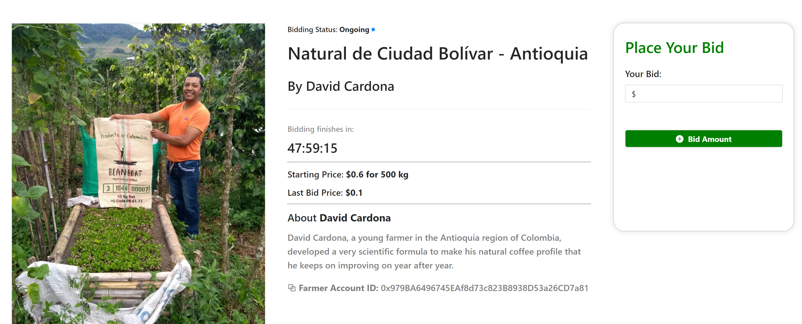
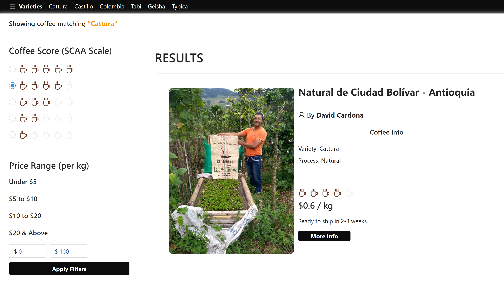
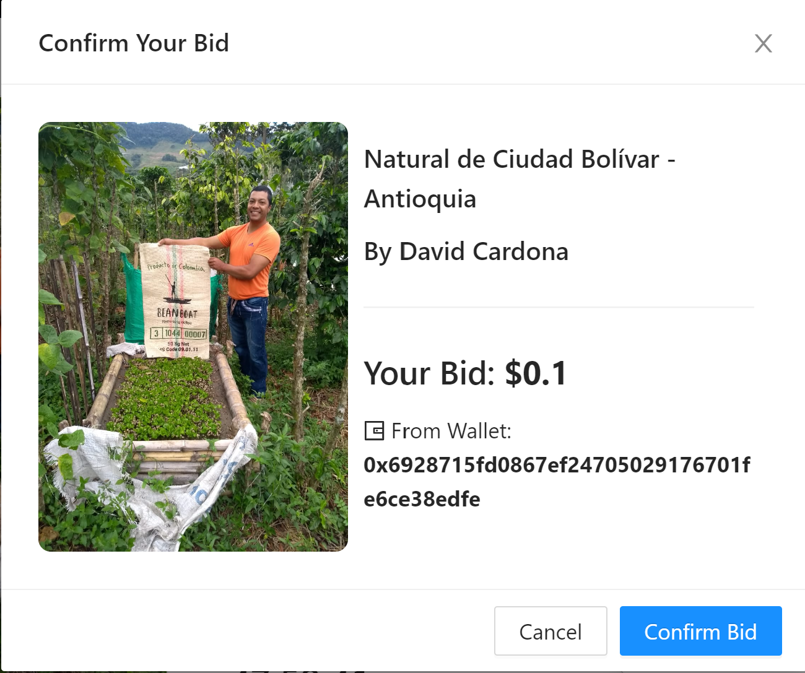

# Web3 Marketplace
**WIP** Web3 Marketplace demo dapp for physical (non-perishable agricultural) products that records farmers, product info (variety, region, etc) names, batches, amount, etc in the blockchain to ensure traceability and authenticity.

### Technologies and stacks used:
- React.js (frontend).
- [Moralis](https://github.com/MoralisWeb3/react-moralis) (backend).
- [Ant Design](https://ant.d) UI library.
- Polygon Mumbai testnet.

### Setup
Make sure you have some accounts on polygon testnet with some matic. The app will authenticate with your Ethereum wallet.

- Add the addresses of your accounts (that has some matic for gas fees) to [Purchase.js](/src/components/Purchase.js) to set up the control and controller accounts.

1. Install dependencies `npm install`.
2. Create an account on [Moralis](https://moralis.io/) (Free one will suffice) and create a dapp server.
3. Take your Moralis Dapp ServerUrl and appID and paste them in [/src/index.js](/src/index.js)
4. Initiate app `npm start`.

#### Screenshots

Photo Credit: [Beanboat](https://beanboat.com) - used with permission.

